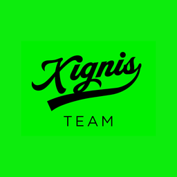

<div align="center">



# Xignis App

### Aplicación de empleados y panel de RH para gestionar permisos y ausencias

[](https://github.com/Leoglez10/xignis-app/actions/workflows/ci.yml)


</div>

> Este README es el punto de entrada del repositorio. Explica **qué es la app,
> cómo levantarla y cómo está organizada**. El detalle profundo (requisitos,
> pantallas, flujos, esquema de base de datos, decisiones técnicas) vive en
> [`docs/`](docs/) y se enlaza desde aquí — no se duplica.
>
> - ¿Solo quieres ejecutarla? → [Puesta en marcha](#-puesta-en-marcha)
> - ¿Quieres entender el producto? → [¿Qué es?](#-qué-es)
> - ¿Vas a tocar código? → [Para desarrolladores](#-para-desarrolladores)

---

## 📋 Contenido

- [¿Qué es?](#-qué-es)
- [¿Para quién es?](#-para-quién-es)
- [Qué hace hoy](#-qué-hace-hoy)
- [Cómo se aprueba un permiso](#-cómo-se-aprueba-un-permiso)
- [Relación con el resto de Xignis](#-relación-con-el-resto-de-xignis)
- [Puesta en marcha](#-puesta-en-marcha)
- [Variables de entorno](#-variables-de-entorno)
- [Cuentas de prueba](#-cuentas-de-prueba)
- [Para desarrolladores](#-para-desarrolladores)
  - [Scripts](#scripts)
  - [Estructura del proyecto](#estructura-del-proyecto)
  - [Rutas de la aplicación](#rutas-de-la-aplicación)
  - [Tests](#tests)
  - [Apps móviles con Capacitor](#apps-móviles-con-capacitor)
- [Datos y base de datos](#-datos-y-base-de-datos)
- [Integración continua y despliegue](#-integración-continua-y-despliegue)
- [Seguridad](#-seguridad)
- [Limitaciones conocidas](#-limitaciones-conocidas)
- [Documentación](#-documentación)
- [Créditos](#-créditos)

---

## 🎯 ¿Qué es?

Xignis App es una aplicación interna de recursos humanos. Su función principal es
**pedir, revisar y aprobar permisos de ausencia** (vacaciones, enfermedad, asuntos
personales).

Tiene dos caras dentro de un mismo código:

- **Para el empleado:** una app pensada primero para el teléfono. Entra, pide un
  permiso en unos pocos pasos y ve en qué estado va.
- **Para jefes y RH:** un panel para computadora, con listas, filtros, calendario
  de ausencias, indicadores y reportes.

La misma base de código se publica como **web** y se empaqueta como **app nativa
de Android e iOS** mediante Capacitor.

> 💡 **¿Qué es Capacitor?**
> No traduce la app a Swift o Kotlin. Genera un proyecto nativo que abre la app
> web dentro de un contenedor del sistema y le da acceso a funciones del teléfono
> (vibración, red, almacenamiento). El razonamiento de esta decisión está en
> [`docs/tech.md`](docs/tech.md).

---

## 👥 ¿Para quién es?

La autoridad real de cada persona se lee de la columna `role` en la tabla
`profiles`, no de lo que se elija en la pantalla de inicio de sesión.

| Rol | Qué puede hacer |
|---|---|
| `employee` | Crear solicitudes de permiso, ver su historial y cancelar las que aún no se cerraron. |
| `manager` | Revisar las solicitudes de su equipo, aprobarlas o rechazarlas, ver el calendario y el detalle de cada persona a su cargo. |
| `hr_admin` | Revisión final de solicitudes, directorio de empleados, departamentos, campos de perfil, reglas y reportes. |
| `admin` | Mismos paneles que RH; rol técnico / super admin. |

Reglas de negocio completas: [`docs/rules.md`](docs/rules.md).

---

## ✅ Qué hace hoy

Funcionalidades presentes en el código:

- ✅ **Inicio de sesión** con Supabase Auth y rutas protegidas por rol.
- ✅ **Alta de personas por invitación**: RH crea la cuenta, la persona define su contraseña en `/set-password`. El registro público está deshabilitado ([`docs/auth-password-flow.md`](docs/auth-password-flow.md)).
- ✅ **Recuperación de contraseña** por correo, con el flujo nativo de Supabase.
- ✅ **Solicitud de permiso** con validación de fechas y horario (jornada completa o rango de horas).
- ✅ **Aprobación en dos niveles**: jefe y después RH, con motivo obligatorio al rechazar y registro de auditoría.
- ✅ **Panel de jefe**: pendientes, urgencias, mapa de cobertura del equipo, calendario y acciones en lote.
- ✅ **Panel de RH/admin**: indicadores, distribución por departamento, altas y bajas recientes, gráficas de tendencia.
- ✅ **Directorio de empleados** con detalle por persona, departamentos y campos de perfil configurables.
- ✅ **Reportes** con exportación a PDF (`jspdf`).
- ✅ **Búsqueda** global en `/buscar`.
- ✅ **Notificaciones** y actualización en vivo de solicitudes mediante canales de Supabase Realtime.
- ✅ **Modo sin conexión detectado**: se muestra un aviso cuando el dispositivo pierde la red.
- ✅ **Interfaz en español e inglés** (i18next, idioma por defecto español).
- ✅ **Accesibilidad**: enlace de salto al contenido, foco visible, hojas inferiores navegables por teclado, y pruebas con `vitest-axe`.

🧪 En preparación — las siguientes rutas existen pero muestran una pantalla de
*próximamente*: `/gastos`, `/reportes`, `/nomina`, `/documentos`, `/organizacion`.

---

## 🔄 Cómo se aprueba un permiso

```text
Empleado crea la solicitud
        ↓
¿Tiene jefe asignado?
   sí → pending_manager        no → pending_hr
        ↓                            ↓
   Jefe revisa                       │
   ├─ rechaza → rejected_by_manager  │
   └─ aprueba → approved_by_manager ─┤
                                     ↓
                              RH revisa
                              ├─ aprueba → approved
                              └─ rechaza → rejected

El empleado puede cancelar mientras no se haya cerrado → cancelled
```

Detalle paso a paso de los tres flujos (empleado, jefe, RH):
[`docs/flows.md`](docs/flows.md).

---

## 🔗 Relación con el resto de Xignis

Xignis se reparte en repositorios independientes:

| Repositorio | Qué es |
|---|---|
| [`xignis`](https://github.com/Leoglez10/xignis) | Landing pública de la marca. |
| **`xignis-app`** (este) | Permisos, ausencias y administración de personal. |
| [`gestion-inventario-xignis`](https://github.com/Leoglez10/gestion-inventario-xignis) | Inventario y préstamo de equipo. |

Comparten identidad visual y ambos usan Supabase, pero **son proyectos separados**:
no comparten código, ni esquema de base de datos, ni sesión de usuario.

---

## 🚀 Puesta en marcha

### Requisitos

- **Bun** — el repositorio se maneja con `bun.lock`; la CI lo instala con `oven-sh/setup-bun`.
- Un **proyecto de Supabase** (o la copia local con Docker, ver más abajo).
- Para compilar las apps móviles: **Xcode** (iOS) y/o **Android Studio**.

### Pasos

```bash
git clone https://github.com/Leoglez10/xignis-app.git
cd xignis-app
bun install
cp .env.example .env      # y rellena los valores
bun run dev
```

> ⚠️ Sin `VITE_SUPABASE_URL` y `VITE_SUPABASE_ANON_KEY` la app arranca, pero el
> inicio de sesión muestra el aviso *"Supabase no está configurado"*: el cliente
> de Supabase no se crea (ver [`src/lib/supabase.ts`](src/lib/supabase.ts)).

### Probar contra una base de datos local

Existe la opción de levantar una copia completa de Supabase con Docker para
probar migraciones sin tocar la base real:

```bash
bunx supabase start   # API en http://127.0.0.1:54321, panel en :54323
bunx supabase stop
```

El procedimiento completo, incluido cómo alternar entre la nube y local con
`.env.local`, está en [`docs/desarrollo-local.md`](docs/desarrollo-local.md).

---

## 🔑 Variables de entorno

Declaradas en [`.env.example`](.env.example). El archivo `.env` está en
`.gitignore` y **no debe subirse al repositorio**.

| Variable | Obligatoria | Descripción |
|---|---|---|
| `VITE_SUPABASE_URL` | Sí | URL del proyecto de Supabase. |
| `VITE_SUPABASE_ANON_KEY` | Sí | Clave pública (`anon`) del proyecto. |
| `VITE_SENTRY_DSN` | No | DSN de Sentry. Si está vacío, el monitoreo no se inicializa. |

> ⚠️ Todo lo que empieza con `VITE_` se incrusta en el paquete que descarga el
> navegador. **Nunca** pongas ahí la clave `service_role` ni ningún otro secreto:
> esa clave solo se usa dentro de las funciones de Supabase, leída desde
> `SUPABASE_SERVICE_ROLE_KEY` en el entorno del servidor.

---

## 🧪 Cuentas de prueba

El repositorio documenta cuatro cuentas de **demostración**, una por rol, sobre
el dominio ficticio `@xignis.test` y contra un conjunto de datos marcado como de
prueba:

- Lista y estado actual: [`docs/cuentas-prueba-listas.md`](docs/cuentas-prueba-listas.md)
- Cómo crearlas desde cero en Supabase: [`docs/supabase-test-setup.md`](docs/supabase-test-setup.md) y [`docs/test-accounts.md`](docs/test-accounts.md)
- Semillas SQL: [`supabase/seed_test_accounts.sql`](supabase/seed_test_accounts.sql) y [`supabase/seed_auth_users.sql`](supabase/seed_auth_users.sql)

> ⚠️ Son credenciales **exclusivamente de demostración**, con contraseña
> compartida y visible en la documentación. No las reutilices para cuentas
> reales y no dejes esas cuentas activas en un entorno productivo.

---

## 👨‍💻 Para desarrolladores

**Stack** (versiones tomadas de [`package.json`](package.json)):

| Capa | Tecnología |
|---|---|
| Interfaz | React 19 + TypeScript 6 |
| Empaquetador | Vite 8 |
| Estilos | Tailwind CSS 4 (plugin oficial de Vite) |
| Navegación | React Router 7 |
| Datos remotos | TanStack Query 5 sobre `@supabase/supabase-js` 2 |
| Formularios | React Hook Form + Zod 4 |
| Animación | Framer Motion |
| Móvil | Capacitor 8 (`app`, `haptics`, `network`, `preferences`) |
| Idiomas | i18next + react-i18next (es / en) |
| Monitoreo | Sentry (`@sentry/capacitor` + `@sentry/react`) |
| PDF | jsPDF + jspdf-autotable |
| Tests | Vitest 4 + Testing Library + vitest-axe; Playwright 1.61 |

### Scripts

| Script | Qué hace |
|---|---|
| `bun run dev` | Servidor de desarrollo de Vite. |
| `bun run build` | Comprueba tipos (`tsc -b`) y compila a `dist/`. |
| `bun run preview` | Sirve la compilación de producción. |
| `bun run test` | Tests unitarios y de componente con Vitest. |
| `bun run test:coverage` | Igual, con informe de cobertura (v8). |
| `bun run test:e2e` | Tests de extremo a extremo con Playwright. |
| `bun run cap:sync` | Compila y copia el resultado a los proyectos nativos. |
| `bun run cap:open:ios` | Abre el proyecto de iOS en Xcode. |
| `bun run cap:open:android` | Abre el proyecto de Android en Android Studio. |

> ℹ️ No hay script de *lint*: el proyecto no tiene ESLint configurado. La
> comprobación de tipos va incluida en `bun run build`.

### Estructura del proyecto

Organización por **funcionalidad**, no por tipo de archivo:

```text
xignis-app/
├── src/
│   ├── main.tsx                  ← Punto de entrada: providers, i18n, Sentry
│   ├── app/
│   │   ├── App.tsx               ← ⭐ Todas las rutas y sus roles permitidos
│   │   ├── RequireAuth.tsx       ← Guarda de sesión y rol
│   │   ├── ErrorBoundary.tsx
│   │   ├── navConfig.ts          ← Navegación por rol
│   │   └── modules.ts
│   ├── components/               ← Chrome de la app (Sidebar, TopBar, Splash…)
│   │   └── ui/                   ← Piezas reutilizables (Button, BottomSheet, Modal…)
│   ├── features/
│   │   ├── auth/                 ← Login, recuperar y definir contraseña
│   │   ├── session/              ← AuthContext: sesión y perfil activos
│   │   ├── employee/             ← Inicio del empleado y sus solicitudes
│   │   ├── manager/              ← Panel del jefe: equipo, calendario, revisión
│   │   ├── admin/                ← Panel de RH: KPIs, empleados, departamentos
│   │   ├── leave-requests/       ← ⭐ Dominio de solicitudes (servicios y hooks)
│   │   ├── profiles/ notifications/ search/ settings/ system/
│   ├── lib/                      ← Cliente Supabase, i18n, fechas, realtime…
│   ├── styles/globals.css
│   └── test/setup.ts
├── e2e/                          ← Tests de Playwright
├── docs/                         ← 📚 Documentación del producto y técnica
├── supabase/
│   ├── migrations/               ← Esquema versionado (SQL)
│   └── functions/                ← Funciones de servidor (Deno)
├── android/  ios/                ← Proyectos nativos generados por Capacitor
├── public/                       ← Iconos, manifiesto y .htaccess
└── .github/workflows/ci.yml
```

> 💡 **Regla rápida**
> - ¿Una pantalla? → `src/features/<área>/screens/`
> - ¿Una llamada a Supabase? → `src/features/<área>/services/`
> - ¿Un componente reutilizable? → `src/components/ui/`
> - ¿Una ruta nueva? → `src/app/App.tsx` y `src/app/navConfig.ts`
> - ¿Un cambio de esquema? → una migración nueva en `supabase/migrations/`

### Rutas de la aplicación

Definidas en [`src/app/App.tsx`](src/app/App.tsx). Todas las que no son públicas
pasan por `RequireAuth` con una lista de roles permitidos.

| Ruta | Acceso |
|---|---|
| `/login`, `/forgot-password`, `/set-password` | Pública |
| `/signup` | Redirige a `/login` (registro público deshabilitado) |
| `/profile`, `/settings`, `/buscar` | Cualquier rol autenticado |
| `/employee`, `/employee/request`, `/employee/requests`, `/employee/requests/:requestId` | `employee` |
| `/manager`, `/manager/requests`, `/manager/requests/:requestId`, `/manager/team`, `/manager/member/:memberId`, `/manager/calendar` | `manager` |
| `/admin`, `/admin/requests`, `/admin/requests/:requestId`, `/admin/absences`, `/admin/employees`, `/admin/employees/:id`, `/admin/departments`, `/admin/fields`, `/admin/reports`, `/admin/rules` | `hr_admin`, `admin` |
| `/gastos`, `/reportes`, `/nomina`, `/documentos`, `/organizacion` | Autenticado — pantalla *próximamente* |
| Cualquier otra | Pantalla 404 |

### Tests

```bash
bun run test        # Vitest: jsdom, setup en src/test/setup.ts
bun run test:e2e    # Playwright: navegadores Chromium y "mobile" (Pixel 7)
```

- La configuración de Vitest vive dentro de [`vite.config.ts`](vite.config.ts) y
  excluye `e2e/`, `node_modules/`, `dist/`, `.claude/` y `.agents/`.
- Playwright levanta la app por su cuenta en `http://127.0.0.1:4173`
  ([`playwright.config.ts`](playwright.config.ts)). En CI reintenta dos veces y
  guarda captura de los fallos.

### Apps móviles con Capacitor

Configuración en [`capacitor.config.ts`](capacitor.config.ts): identificador
`com.xignis.app`, nombre `Xignis`, contenido servido desde `dist`.

```bash
bun run cap:sync          # build + copia a android/ e ios/
bun run cap:open:ios      # abre Xcode
bun run cap:open:android  # abre Android Studio
```

Desde ahí se ejecuta en simulador o dispositivo con las herramientas nativas.

> 💡 La compilación fija `target: "safari15"` porque en iOS la app corre dentro
> de WKWebView. Las librerías pesadas se separan en paquetes propios para que el
> arranque en frío sea más rápido; el detalle está comentado en `vite.config.ts`.

---

## 💾 Datos y base de datos

Todos los datos viven en **Supabase (PostgreSQL)**. La app no guarda información
de negocio en el dispositivo: solo la sesión, mediante
`@capacitor/preferences` con la clave `xignis.auth:v1`
([`src/lib/capacitorStorage.ts`](src/lib/capacitorStorage.ts)).

Tablas creadas por la migración base
[`supabase/migrations/20260430223000_baseline.sql`](supabase/migrations/20260430223000_baseline.sql):

| Tabla | Contenido |
|---|---|
| `profiles` | Persona, rol, puesto, jefe asignado, departamento. |
| `departments` | Departamentos y su color. |
| `leave_requests` | Solicitudes de permiso y su estado. |
| `leave_request_approvals` | Auditoría de cada aprobación o rechazo. |
| `notifications` | Avisos dentro de la app. |
| `employment_events` | Altas, bajas y otros eventos laborales. |
| `app_settings` | Ajustes de la organización. |
| `profile_field_defs` | Campos de perfil configurables por RH. |

El acceso se controla con **RLS** (Row Level Security): las políticas viven en las
propias migraciones, de modo que cada usuario solo ve las filas que le
corresponden. Descripción del modelo de datos:
[`docs/database.md`](docs/database.md).

### Funciones de servidor

En [`supabase/functions/`](supabase/functions/) hay cinco funciones en Deno que
necesitan la clave `service_role` y por eso no pueden ejecutarse desde el
navegador:

| Función | Para qué |
|---|---|
| `admin-create-user` | Alta de una persona por parte de RH. |
| `admin-delete-user` | Baja de una cuenta. |
| `admin-grant-access` | Conceder acceso / enviar invitación. |
| `admin-reset-access` | Reiniciar el acceso de una cuenta. |
| `account-access` | Consultar el estado de activación de una cuenta. |

### Migraciones

El esquema está versionado en `supabase/migrations/` con archivos con marca de
tiempo. Para un cambio de esquema: crea una migración nueva, pruébala contra la
copia local ([`docs/desarrollo-local.md`](docs/desarrollo-local.md)) y solo
después aplícala al proyecto remoto. No edites migraciones ya aplicadas.

---

## 🔁 Integración continua y despliegue

Definido en [`.github/workflows/ci.yml`](.github/workflows/ci.yml).

### Trabajo `verify`

Se ejecuta en **cada pull request**, en **cada push a `main`** y a mano
(`workflow_dispatch`):

1. `bun install --frozen-lockfile`
2. `bun run test`
3. `bun run build`
4. Instala Chromium y ejecuta `bun run test:e2e`

Usa valores de Supabase ficticios, de modo que las pruebas automáticas nunca
tocan la base real.

### Trabajo `production-build`

Se ejecuta **solo fuera de los pull requests** (es decir, en push a `main` o
manualmente):

1. Compila con las credenciales reales, guardadas como *secrets* del repositorio.
2. Copia [`public/.htaccess`](public/.htaccess) a `dist/` — reescribe todas las
   rutas a `index.html`, que es lo que necesita una aplicación de una sola página
   servida con Apache.
3. Sube `dist/` como artefacto (retención: 1 día).
4. Comprueba que el servidor FTP resuelve y responde.
5. Despliega por FTP a Hostinger, en `/public_html/app/`.

> ⚠️ Un push a `main` publica en producción. Los *secrets* necesarios
> (`SUPABASE_URL`, `SUPABASE_ANON_KEY`, `FTP_SERVER`, `FTP_USERNAME`,
> `FTP_PASSWORD`) se configuran en los ajustes del repositorio en GitHub, nunca
> en el código.

---

## 🔒 Seguridad

- El rol elegido en la pantalla de inicio de sesión es solo una ayuda visual; la
  autorización real se resuelve contra `profiles.role` y las políticas RLS.
- El registro público está deshabilitado: las cuentas se crean por invitación
  desde RH.
- Las operaciones privilegiadas están fuera del navegador, en funciones de
  Supabase que leen `SUPABASE_SERVICE_ROLE_KEY` del entorno.
- `Sentry` se inicializa únicamente si existe `VITE_SENTRY_DSN`, con
  `sendDefaultPii: false`.
- El repositorio **no contiene** archivos `.env` con valores reales: solo
  `.env.example` con las claves vacías.

> ⚠️ Antes de considerar la app lista para producción, revisa los avisos
> pendientes anotados en
> [`docs/mejoras-estado-2026-07-12.md`](docs/mejoras-estado-2026-07-12.md) y
> [`docs/siguiente-sesion-2026-07-14.md`](docs/siguiente-sesion-2026-07-14.md),
> entre ellos la protección contra contraseñas filtradas de Supabase.

---

## ⚠️ Limitaciones conocidas

- El proyecto está en versión `0.1.0` y sigue en desarrollo activo.
- Cinco módulos de la plataforma (gastos, reportes, nómina, documentos,
  organización) son solo pantallas de *próximamente*.
- La traducción a inglés cubre parte de la interfaz; el idioma por defecto y el
  de respaldo es el español.
- No hay ESLint configurado.
- La suite de extremo a extremo es una comprobación de humo: verifica que el
  login carga y que una ruta protegida redirige.
- El proyecto de Supabase remoto conserva tablas antiguas en español de una
  versión anterior, pendientes de migrar o eliminar.
- El repositorio no incluye archivo `LICENSE`, por lo que **no tiene una licencia
  pública declarada**.

---

## 📚 Documentación

Todo en [`docs/`](docs/).

### Producto y diseño

| Documento | Propósito |
|---|---|
| [`docs/requirements.md`](docs/requirements.md) | Documento de requisitos: visión, roles y alcance. |
| [`docs/rules.md`](docs/rules.md) | Reglas de negocio: estados, validaciones y permisos. |
| [`docs/flows.md`](docs/flows.md) | Flujos de empleado, jefe y RH paso a paso. |
| [`docs/screens.md`](docs/screens.md) | Inventario de pantallas y prioridad de diseño. |
| [`docs/design.md`](docs/design.md) | Especificación visual y kit de interfaz. |

### Técnica

| Documento | Propósito |
|---|---|
| [`docs/tech.md`](docs/tech.md) | Decisiones de arquitectura y por qué Vite en lugar de Next.js. |
| [`docs/api.md`](docs/api.md) | Contratos de la capa de servicios y errores esperados. |
| [`docs/database.md`](docs/database.md) | Modelo relacional. |
| [`docs/auth-password-flow.md`](docs/auth-password-flow.md) | Invitaciones, definición y recuperación de contraseña. |
| [`docs/desarrollo-local.md`](docs/desarrollo-local.md) | Supabase local con Docker y ciclo de migraciones. |
| [`docs/supabase-test-setup.md`](docs/supabase-test-setup.md) | Preparación de las cuentas de demostración. |

### Estado del trabajo

| Documento | Propósito |
|---|---|
| [`docs/tasks.md`](docs/tasks.md) | Backlog por fases. |
| [`docs/mejoras-2026-07-12.md`](docs/mejoras-2026-07-12.md) | Backlog vigente: auditoría y plan por fases P0–P4. |
| [`docs/mejoras-estado-2026-07-12.md`](docs/mejoras-estado-2026-07-12.md) | Qué de ese plan quedó terminado. |
| [`docs/siguiente-sesion-2026-07-14.md`](docs/siguiente-sesion-2026-07-14.md) | Pendientes inmediatos. |

### Histórico

Se conservan como registro; **no son fuente de verdad** sobre el estado actual:

| Documento | Nota |
|---|---|
| [`docs/handoff.md`](docs/handoff.md) | Traspaso de una etapa temprana. Menciona rutas, migraciones y herramientas que ya cambiaron. |
| [`docs/mejoras-2026-06-28.md`](docs/mejoras-2026-06-28.md) | Iteración de junio. |
| [`docs/mejoras-2026-07-07.md`](docs/mejoras-2026-07-07.md) | Iteración de julio, reemplazada por `mejoras-2026-07-12.md`. |
| [`docs/cuentas-prueba-listas.md`](docs/cuentas-prueba-listas.md) | Cuentas de demostración, con notas de incidencias ya resueltas. |
| [`docs/test-accounts.md`](docs/test-accounts.md) | Propuesta inicial de esas mismas cuentas. |

---

## 👤 Créditos

<div align="center">

Diseñado y desarrollado por **Leonardo González**

[](https://github.com/Leoglez10)

</div>
